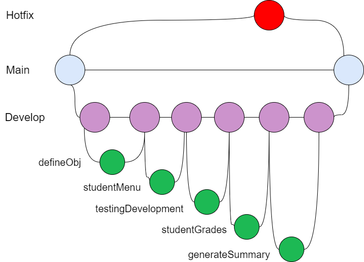
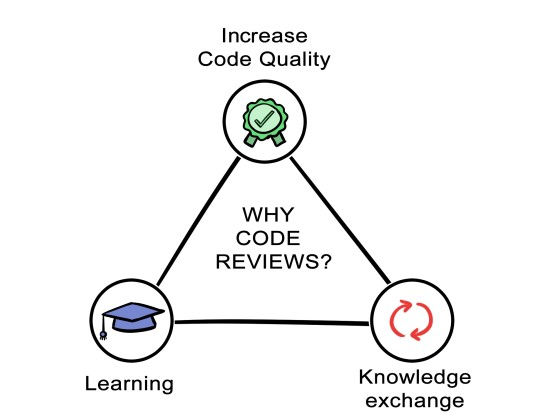
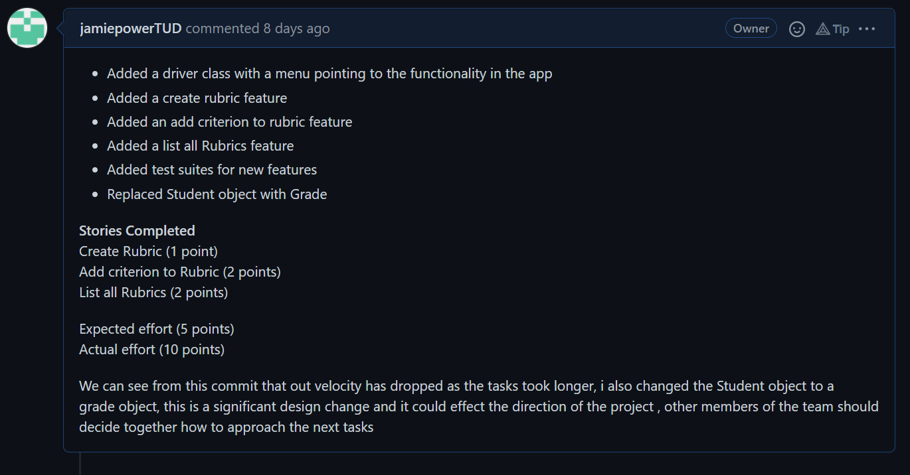
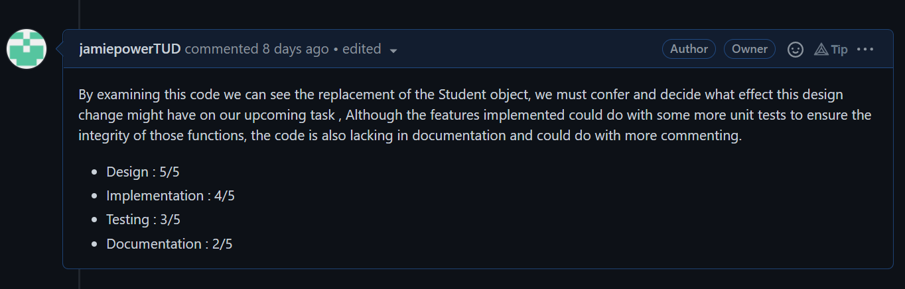

# Demonstrating Software Quality

### Introduction

In this guide I will demonstrate Agile and Scrum best practices when it comes
to Software Development. This document is a reference on how to apply these
 practices in your own software projects as 
well outlining the benefits of doing so.

Each commit in the repository will document and track the changes that occur in the 
project overtime, and I will demonstrate how version control,GitFlow and code reviews 
play a role in throughout the development cycle.

<br>

## Table of Contents

<br>

* **Sprint Backlog and Task estimation**
    * Backlog
    * Estimation
    * Velocity 
* **Unit Testing and Test-Driven Development**
    * Unit Testing
    * Creating a Feature
    * Success 
    * Not found
    * Rubric Full
    * Resolution
* **Code Coverage**
    * Coverage Tool
    * Coverage Report
* **Team Version Control**
    * GitFlow
    * Project Branches
* **Code Review**
    * Pull Request
    * Example
    * Result
* **References**

<br>
  

## Sprint Backlog and Task Estimation 

<br>

Before starting a new software project it is worthwhile outlining goals and 
objects and to budget the time and effort required to complete these tasks.

<br>


<br>

The scrum methodology begins by developing a **Sprint Backlog**. A sprint 
backlog is a series of tasks derived from the product backlog, the demands
of the product owner are translated into small manageable tasks to be completed
during a sprint. It is important to discuss these objectives with your team 
and outline what tasks will be completed in the next sprint. 

<br>

There are a few ways to make your sprint backlog as effective and 
efficient as possible **[1]**

* Include all members of the team to ensure a sense of inclusivity 
and to offer varying perspectives
* Define a criteria by which all team members will consider a 
task to be finished
* Allow team members to delegate and assign tasks to each other
to foster ongoing collaboration and communication
* Ensure the backlog is dynamic, and it can adapt and react to 
changes

<br>

#### Backlog

<br>

<table>
<thead>
<tr>
<th>User Story</th>
<th>In progress</th>
<th>Completed</th>
</tr>
</thead>
<tbody>
<tr>
<td><b>  Grading Management</b></td>
<td align="center"></td>
<td></td>
</tr>
<tr>
<td>Define a Grade </td>
<td align="center"></td>
<td align="center">X</td>
</tr>
<tr>
<td>Define a Rubric </td>
<td align="center"></td>
<td align="center">X</td>
</tr>
<tr>
<td>Define a Criterion</td>
<td align="center"></td>
<td align="center">X</td>
</tr>
<tr>
<td> <b>Adding and Searching features </b> </td>
<td></td>
<td></td>
</tr>
<tr>
<tr>
<td>Create a new Rubric</td>
<td align="center"></td>
<td align="center">X</td>
</tr>
<tr>
<td>Add Criterion to Rubric</td>
<td align="center"></td>
<td align="center">X</td>
</tr>
<tr>
<td>List all Rubrics</td>
<td align="center"></td>
<td align="center">X</td>
</tr>
<tr>
<td>Retrieve Rubric by Name</td>
<td align="center"></td>
<td align="center">X</td>
</tr>
<tr>
<td>Add Score to a Grade</td>
<td align="center"></td>
<td align="center">X</td>
</tr>
<tr>
<td>List all Student Grades</td>
<td align="center"></td>
<td align="center">X</td>
</tr>
<tr>
<td>Get Grade By Rubric</td>
<td align="center"></td>
<td align="center">X</td>
</tr>
<tr>
<tr>
<td><b>Grade Summaries</b></td>
<td align="center"></td>
<td></td>
</tr>
<tr>
<td>Generate Rubric Summary</td>
<td align="center"></td>
<td align="center">X</td>
</tr>
<tr>
<td>Generate Criterion Summary</td>
<td align="center"></td>
<td align="center">X</td>
</tr>
</tbody>
</table>

<br>

We see that we have defined the goals are our project, we have defined three 
Sprints with their own set of tasks. The Sprints give your team a chance to 
reflect on the tasks, and the progress made, this is also a good opportunity 
to detect any significant changes which might alter the direction of the 
project. 

<br>

Once you have outlined the sprints, and the tasks associated with them the next
approach is to develop a task estimation. Task estimation is the process of 
estimating the effort or time needed to complete a task. The metric by which a 
tasks' completion is measured by is completely ambiguous and decided by the team. 

<br>

#### Estimation

For this project 
will we measure our increments of effort in units of 5 minutes worth of work, we will
also determine the difficulty of each task from a scale of 1-5. When we examine
each task we will assess the difficulty and expected time of completion in order to manage and
control project resources and meet time constraints **[2]**.

**1 unit = 5 minutes**

<br>

<table>
<thead>
<tr>
<th> Task </th>
<th> Unit </th>
<th align="center"> Difficulty   </th>
</tr>
</thead>
<tbody>
<tr>
<td>Define a Grade </td>
<td align="center">3</td>
<td align="center">2</td>
</tr>
<tr>
<td>Define a Rubric </td>
<td align="center">3</td>
<td align="center">2</td>
</tr>
<tr>
<td>Define a Criterion</td>
<td align="center">3</td>
<td align="center">2</td>
</tr>
<tr>
<td>Create a new Rubric</td>
<td align="center">1</td>
<td align="center">1</td>
</tr>
<tr>
<td>Add Criterion to Rubric</td>
<td align="center">2</td>
<td align="center">3</td>
</tr>
<tr>
<td>List all Rubrics</td>
<td align="center">2</td>
<td align="center">1</td>
</tr>
<tr>
<td>Retrieve Rubric by Name</td>
<td align="center">4</td>
<td align="center">4</td>
</tr>
<tr>
<td>Add Score to a Grade</td>
<td align="center">5</td>
<td align="center">4</td>
</tr>
<tr>
<td>List all Student Grades</td>
<td align="center">2</td>
<td align="center">2</td>
</tr>
<tr>
<td>Generate Rubric Summary</td>
<td align="center">6</td>
<td align="center">5</td>
</tr>
<tr>
<td>Generate Criterion Summary</td>
<td align="center">6</td>
<td align="center">5</td>
</tr>
</tbody>
</table>

<br>

In our task estimation we have assigned an estimated **amount of time required** to complete
each task as well as the **complexity** of the task. The implementation of each task varies in time and
difficulty as some tasks are easy to complete but time-consuming while others require a lot of thought
but are quick to complete.

<br>

Take for instance creating a new Rubric, this task involves defining the attributes of 
the object and instantiating it which is a straightforward task, compared to the generating a Student
grade summary which involves iterating over each grade and accumulating their attributes to perform
calculations on them to create the summary which is a more cumbersome task.

<br>

#### Velocity

By defining an effort metric, we can also calculate the **velocity** of our sprints by comparing
the total number of units achieved by the number of sprints completed. We will split the tasks into 
three sprints , object definition, object adding and retrieving and then summaries. Our expected velocity 
is 12.33 (37 / 3), so the average amount of effort for each sprint will be 12.33. 

**Velocity** acts as a feedback mechanism for teams by giving them a tangible measure of progress, 
it is expected to be slightly volatile, but a well-organised team should expect an average downward 
trend of 10% when being examined on a burn-down chart **[3]**. A low velocity can indicate that a team
or developer is working inefficiently.

<br>

## Unit Testing and Test driven Development

Test Driven Development <b>(TDD)</b> is a software development methodology in which test cases are created to define and verify 
what the code can do. To put it another way, test cases for each feature are developed and checked first, 
and if the test fails, new code is written to pass the test, resulting in code that is simple and bug-free **[4]**. TDD follows
a five-step process : 

1. Define Test case
2. Run all tests, examine if any have failed
3. Write code
4. Run tests and Refactor code
5. Repeat process

<br>


<br>

It is only through failing tests that a team may decide to refactor or rewrite 
the code for certain features. There are many benefits to following a 
test driven development process.

- <b>Superior code design and Quality</b> Enforcing high standards on the 
quality of code written and making the codebase difficult to break. It also makes 
our code adhere to **DRY**(Don't Repeat Yourself) principles. 

<br>

- <b>Comprehensive Documentation</b> When writing tests for unique specifications, 
programmers build a comprehensive specification right away. It already contains 
all the steps that users are likely to take. As a result, we already have a 
scenario that will guide us forward. 

<br>

- <b>Reduces development time</b> By making code less likely to falter and more reusable 
it reduces the likely hood of developers running into design issues and bugs later in the 
development cycle

In this section we will discuss the process 
of testing the features that we right and outline what steps will need to be 
taken if the tests fail. 

<br>


#### Unit Testing

Throughout the development of the project I will be utilising the
**JUnit** framework to perform unit testing on our Java code, There are various specific
and non-language specific frameworks that can be used in order to aid the 
Test driven development process.To demonstrate the application of Unit testing
we will examine the process of writing code, testing the feature, and the decision that
will be made based on the result. 

<br>

#### Creating a feature

To demonstrate unit testing we will focus on the <b>Add Criterion
to Rubric</b> feature, I will examine the code of written, define the 
necessary tests and take the appropriate steps following the result 
of the tests.

<br>

##### Commit
"_Added system menu, controller class and testing suites_"

<br>

##### Branch
studentMenu

<br>

##### Classes
Controller.java
<br>
DSQTestUnit.java

<br>

```java
    public String addCriterion(String rubric , String criterion)
    {
        String response = "" ;
        boolean found = false ;
        for(Rubric rub : rubrics)
        {
            if(rub.title.equalsIgnoreCase(rubric)) {
                if(rub.getCriteria().size() == 10)
                {
                    response = "Rubric Full" ;
                }
                else {
                        Criterion criteria = createCriterion(criterion);
                        rub.getCriteria().add(criteria);
                        found = true ;
                        response = "Criteria Added" ; }
            }
        }
        if(!found){
            response = "Rubric not found" ;
        }
        return response ;
    }
```

<br>

This function receives the name of both a rubric, and the 
name of the Criteria to be created. It searches our list of
Rubrics and once found ,instantiates a new Criterion with a score
of 0 and returns a response. There are three possible outcomes to calling
this function.

- The rubric is found and the criteria is added.
- The rubric is found and the list of criteria is full (10 max)
- The rubric is not found.

<br>

#### Success

<br>

With this in mind I create a test for each outcome to verify the 
appropriate response is returned.The first test I conduct is to 
successfully add a criterion. In the following test a Rubric 
is created a criterion is added to it successfully.  


```java
  @Test
    public void testAddCriterion()
    {
        Controller c = new Controller();
        Rubric rub = new Rubric("test");
        c.rubrics.add(rub);
        assertEquals("Criteria Added",c.addCriterion("test","test"));
    }
```


<br>

#### Not found 

<br>

This passing test verifies that we receive an appropriate response
when a Rubric is not found.

```java
  @Test
    public void testAddCriterionToNoRubric()
    {
        Controller c = new Controller();
        assertEquals("Rubric not found",c.addCriterion("test","test"));
    }
```

<br>

#### Rubric Full 
 
 <br>
 
 Finally, I want to test what happens when I exceed the limit of Criteria 
 being added to a Rubric. The test defines a rubric and adds ten criterion 
 to it.

```java
  @Test
    public void testAddCriterionToFullRubric()
    {
        Controller c = new Controller();
        Rubric rub = new Rubric("test");
        c.rubrics.add(rub);

        for(int i = 0 ; i < 10 ; i ++)
        {
            c.addCriterion("test","test");
        }
        assertEquals("Rubric Full",c.addCriterion("test","test"));
    }
```

<br>

but notice that the test has <b>failed</b>. 

<br>


<br>

The unit test reveals that the function is indicating the rubric is not found rather
than notifying that the rubric is full. It is clear I have made an error in my code 
and I must address it.  

<br>


#### Resolution

Upon revisiting my function , I noticed that when a Rubric is found and its capacity
is full the "**found**" boolean is never switched, therefore when the condition to check
whether a Rubric has been found is reached, the response will always be changed to not found.
I have highlighted the solution in the image below. 

<br>

```java
    public String addCriterion(String rubric , String criterion)
    {
        String response = "" ;
        boolean found = false ;
        for(Rubric rub : rubrics)
        {
            if(rub.title.equalsIgnoreCase(rubric)) {
                if(rub.getCriteria().size() == 10)
                {
                    // Solution 
                    found = true
                    response = "Rubric Full" ;
                }
                else {
                        Criterion criteria = createCriterion(criterion);
                        rub.getCriteria().add(criteria);
                        found = true ;
                        response = "Criteria Added" ; }
            }
        }
        if(!found){
            response = "Rubric not found" ;
        }
        return response ;
    }
```


<br>

We can see that by comprehensively testing our code we can notice issues before they 
arise later, Once I have committed my code, members of my team will be satisfied that 
my feature works correctly based on the testing units I have provided.

<br>

## Code Coverage 

<br>

Code coverage is a software testing measure that determines the number of lines of code that are successfully checked 
during a test process, which aids in determining how thoroughly a software is tested **[5]**. **Code Coverage tools** are primarily
used to examine whether sufficient testing has been implemented for the codebase as well as identifying code which is 
unreachable,never used or redundant. There are various benefits to using Code Coverage tools such as :

<br>

- <b>Simpler Code Maintenance :</b> Coverage tools help determine the scalability and quality of code
- <b>Highlights dead code:</b> As mentioned before, Coverage tools help to identify low-quality code
- <b>Faster development time :</b> Increases productivity and efficiency acting as a catalyst for development time

<br>

Code Coverage tools abstract the calculations from the user, but it important to understand the metric and what it
implies.The formula to compute code coverage is as follows.

<br>

<p align="center"> <b>Code Coverage Percentage = (Sum of lines of code executed/Sum of lines of code in a system component) * 100</b>  </p>


 It is worth noting that 100% coverage does not guarantee the codebase functions perfectly, and
 it is completely covered by tests. Coverage is measured in various different ways including
 but not limited to 
 
 - **Branch Coverage :** Measures that every branch of a conditional is executed
 - **Function Coverage :** Measures all functions and methods are executed
 - **Statement Coverage :** Measures that each executable statement is called 
 - **Loop Coverage :** Ensures all loops within the code are executed at least once
 
 <br>
 
 #### Code Coverage Tool 
 
As with testing suites, there are a variety of language and non-language specific tools 
that can be used for coverage. For the purpose of this project I will be using '**JaCoCo**'
which is IntelliJ's built-in coverage tool.We can utilise this tool by clicking the 
'**Run with Coverage**' button.

<br>


<br>

#### Coverage Report

Once our coverage tool has finished computing it generates a **coverage report**. The 
**coverage report** provides a breakdown of each class with the project and details the 
extent of coverage provided in each class **[6]**.

<br>


<br>

The breakdown shows us the distribution of coverage by Class , 
method and line. Because we have provided a test for a function within the
Controller class, this class has been considered 100% covered, but the methods 
and lines within the class are not, this is an important this distinction to make.
The **JaCoCo** testing tool also covers branching coverage as we mentioned before and 
calculates that all branches within my conditionals are satisfied. 

<br>

There is no coverage for either the Driver class, or the test runner as non of the code in these classes 
require tests. The Grade class also has no coverage as of the time of writing, there are no 
tests or features using that class yet, therefore we can see the difference between code
that is covered and that which is not.


<br>

## Team Version Control 

<br>

**Version Control** is the practice of managing and changes to software during its development cycle. It is 
imperative that any team collaborating on a project utilises some form of version control in order to review
code, manage changes, fix bugs and avoid conflicting contributions to the codebase. **Version Control** also 
makes the development process structured and efficient and is necessary for any teams who wish to practice 
DevOps. 

<br>

#### GitFlow

There are numerous version control systems **(VCS)** that can be used to manage code, **Git** being the most popular
tool, it allows developers to create repositories to store the latest releases of code and enables easier team
collaboration. With Git, we have Gitflow which is a conceptual implementation of a Git Workflow **[7]**. Gitflow works using
the "**branch**" feature. The branch feature allows developers to create a copy of the current branch and work separately from 
the main branch which is reserved for the official release. Typically, the team will create a **Develop** branch which denotes the project currently
under development and will make other branches for each new feature being developed also known as feature branches.

<br>


<br>

The Gitflow process works accordingly 

1. Create a new feature branch and checkout(move) to it 
2. Write the code for the new feature
3. Commit and Push the branch 
4. Open a pull request (Code Review)
5. Merge the branch into develop

If a serious or pressing issue is spotted in the main branch, we will create a branch called a "**hotfix**"
 which serves to fix bugs which require immediate attention and merge it directly back into main.
 
<br>

#### Project Branches


I have outlined the branches that we will use to practice **version control** for this project. 

<br>



<br>

We begin with our main branch which is the official release branch, to begin development we created a 
develop branch from main. This branch will be the most up to date stable development release, from here 
we will break off into individual feature branches for each component of the project. Branches may also
assume the role of a Sprint branch which can cover multiple stories in one single branch. The branches for 
our project are similar as they cover more than one feature each. 

Each branch covers a core section of the project, and I will outline what each has covered.

<br>

* **defineObj :** Described the objects being used in the project as well
as task estimation and creating our backlog
* **studentMenu :**  Created the driver and controller class with object creation, adding 
and listing
* **testingDevelopment :** Completed test example in document, added validation 
and more unit tests 
* **studentGrades :** Added the grading students feature as well as listing 
all student grades, completed version control section in document
* **generateSummary :** added generating rubric, grade and criterion summaries, document
completed

<br>

Once each branch is completed, and we were satisfied with the project, we merged the 
develop branch back into main thus publishing an official release.

<br>


## Code Review Checklist 

<br>

Code Reviews offer an opportunity to assess and discuss the contribution of a member of the team . Code reviews
 can highlight bugs or potential errors in code , they can identify design 
flaws which might affect the project later in the development cycle. 

<br>

Code Reviews should aim to instil
confidence and motivation into developers by helping them improve and become better and to learn from mistakes as 
well as achievements.

<br>



<br>

Benefits and Reasons to conduct Code Reviews include **[8]**

- **Sharing Knowledge :** Code reviews present an opportunity to provide guidance and advice to other developers
in order to help them improve
- **Maintains Standard :** When developers know their contribution will be assessed they will always ensure their code
is tested, documented and readable which in turn enforces high standards
- **Accurate Estimation :** Once the team has assessed the code written it helps to create more accurate estimations 
on further tasks as well as on the project as a whole.

<br>

#### Pull Requests

Pull Requests are a platform specific feature that exist in repository managers such as **GitHub** or 
**BitBucket**. When a branch is pushed it opens a prompt to create a pull request, this is essentially a way
to publicise the changes to other members of the team, and it initiates a code review. A team can decide 
the criteria and metric by which they review code, some might be more design oriented and others might place
emphasis on the documentation or readability. For the code reviews in this project I will outline the criteria which
I will use to assess the pull requests that I open for each branch.

<br>

* **Design :** The structure of the code and how well it fits into the project as a whole, does the code align with any 
design patterns included? 
* **Implementation :** How well does the feature work? does it satisfy the product owners requirements?
* **Testing :** How comprehensively has the code been tested? is it difficult to break? have edge cases 
been covered?.
* **Documentation :** The extent to which code is commented , explained and accounted for?. 

<br>

#### Example

When I pushed the **studentMenu** branch I created a pull request in order to review my code but also 
to test whether the code could be merged successfully without any conflicts. In my request, I outline 
what I have contributed, and the amount of time it took to complete against the estimated time I had 
given each task.

<br>



<br>

When the pull request is open we can begin to examine the code that was written as well as compare the changes 
against the existing codebase within the develop branch. After I have assessed the code I provide the developer 
which in this case is myself with some feedback as well as a score for each criterion I have defined out of a maximum of
five. Pull requests also provide an opportunity for other members of the team to drop a comment to provide feedback or 
even advice.

<br>



<br>

#### Result

My assessment for this contribution was a high scoring design and implementation as the code written for the features 
worked correctly and was adapted to the Controller class. The negatives of this assessment appeared when there 
was not a satisfactory amount of tests provided for the feature and there was little to no documentation or commenting in regard to 
each function. Going forward , I will pay closer attention to how much I test my code as well as making sure to document 
and explain any functions I have written. 


<br>


## References 

<br>

[1] [Effective Sprint Backlog](https://www.sealights.io/sprint-velocity/the-sprint-backlog-why-its-important-and-how-to-make-it-great/)

[2] [Agile Metrics](https://www.atlassian.com/agile/project-management/metrics)

[3] [Sprint Velocity](https://www.scruminc.com/velocity/#:~:text=Velocity%20is%20a%20measure%20of,all%20fully%20completed%20User%20Stories.)

[4] [Test-Driven Development](https://www.guru99.com/test-driven-development.html)
    
[5] [Code Coverage](https://www.codegrip.tech/productivity/everything-you-need-to-know-about-code-coverage/)

[6] [Coverage Report](https://www.jetbrains.com/help/idea/viewing-code-coverage-results.html)

[7] [Git Flow](https://www.perforce.com/blog/vcs/what-is-version-control)

[8] [Code Reviews](https://www.atlassian.com/agile/software-development/code-reviews)

<br>