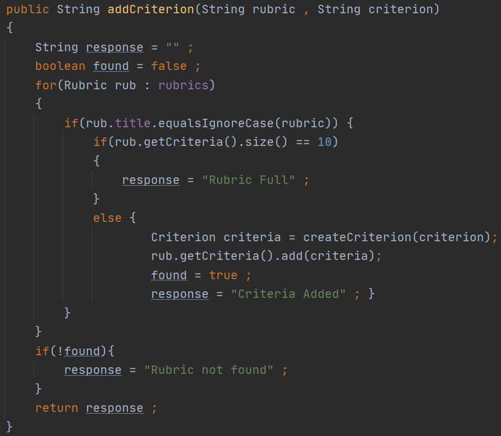
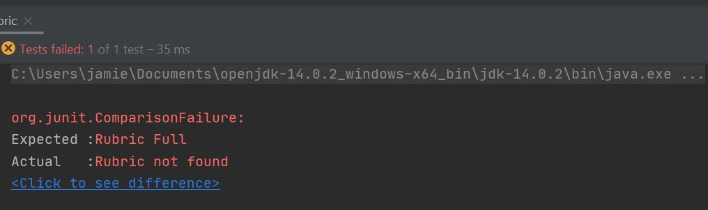

# Demonstrating Software Quality

### Sprint Backlog and Task Estimation 

Before starting a new software project it is worthwhile outlining goals and 
objects and to budget the time and effort required to complete these tasks.

 

The scrum methodology begins by developing a **Sprint Backlog**. A sprint 
backlog is a series of tasks derived from the product backlog, the demands
of the product owner are translated into small manageable tasks to be completed
during a sprint. It is important to discuss these objectives with your team 
and outline what tasks will be completed in the next sprint. 

 

There are a few ways to make your sprint backlog as effective and 
efficient as possible 

* Include all members of the team to ensure a sense of inclusivity 
and to offer varying perspectives
* Define a criteria by which all team members will consider a 
task to be finished
* Allow team members to delegate and assign tasks to each other
to foster ongoing collaboration and communication
* Ensure the backlog is dynamic, and it can adapt and react to 
changes

 

<table>
<thead>
<tr>
<th>User Story</th>
<th>In progress</th>
<th>Completed</th>
</tr>
</thead>
<tbody>
<tr>
<td><b>  Grading Management</b></td>
<td align="center"></td>
<td></td>
</tr>
<tr>
<td>Define a Grade </td>
<td align="center"></td>
<td align="center">X</td>
</tr>
<tr>
<td>Define a Rubric </td>
<td align="center"></td>
<td align="center">X</td>
</tr>
<tr>
<td>Define a Criterion</td>
<td align="center"></td>
<td align="center">X</td>
</tr>
<tr>
<td>Define a Student Grade</td>
<td align="center"></td>
<td align="center">X</td>
</tr>
<tr>
<td> <b>Adding and Searching features </b> </td>
<td></td>
<td></td>
</tr>
<tr>
<tr>
<td>Create a new Rubric</td>
<td align="center"></td>
<td align="center">X</td>
</tr>
<tr>
<td>Add Criterion to Rubric</td>
<td align="center"></td>
<td align="center">X</td>
</tr>
<tr>
<td>List all Rubrics</td>
<td align="center"></td>
<td align="center">X</td>
</tr>
<tr>
<td>Retrieve Rubric by Name</td>
<td align="center"></td>
<td align="center">X</td>
</tr>
<tr>
<td>Add Score to a Grade</td>
<td align="center">X</td>
<td></td>
</tr>
<tr>
<td>List all Student Grades</td>
<td align="center">X</td>
<td></td>
</tr>
<tr>
<td><b>Grade Summaries</b></td>
<td></td>
<td></td>
</tr>
<tr>
<td>Generate Graded Students Summary</td>
<td></td>
<td></td>
</tr>
<tr>
<td>Generate Rubric Summary</td>
<td></td>
<td></td>
</tr>
<tr>
<td>Generate Criterion Summary</td>
<td></td>
<td></td>
</tr>
</tbody>
</table>

 

We see that we have defined the goals are our project, we have defined three 
Sprints with their own set of tasks. The Sprints give your team a chance to 
reflect on the tasks, and the progress made, this is also a good opportunity 
to detect any significant changes which might alter the direction of the 
project. 

 

Once you have outlined the sprints, and the tasks associated with them the next
approach is to develop a task estimation. Task estimation is the process of 
estimating the effort or time needed to complete a task. The metric by which a 
tasks' completion is measured by is completely ambiguous and decided by the team. 

 

For this project 
will we measure our increments of effort in units of 5 minutes worth of work, we will
also determine the difficulty of each task from a scale of 1-5. When we examine
each task we will assess the difficulty and expected time of completion in order to manage and
control project resources and meet time constraints.

**1 unit = 5 minutes**
 

<table>
<thead>
<tr>
<th> Task </th>
<th> Unit </th>
<th align="center"> Difficulty   </th>
</tr>
</thead>
<tbody>
<tr>
<td>Define a Grade </td>
<td align="center">3</td>
<td align="center">2</td>
</tr>
<tr>
<td>Define a Rubric </td>
<td align="center">3</td>
<td align="center">2</td>
</tr>
<tr>
<td>Define a Criterion</td>
<td align="center">3</td>
<td align="center">2</td>
</tr>
<tr>
<td>Define a Student Grade</td>
<td align="center">3</td>
<td align="center">2</td>
<tr>
<td>Create a new Rubric</td>
<td align="center">1</td>
<td align="center">1</td>
</tr>
<tr>
<td>Add Criterion to Rubric</td>
<td align="center">2</td>
<td align="center">3</td>
</tr>
<tr>
<td>List all Rubrics</td>
<td align="center">2</td>
<td align="center">1</td>
</tr>
<tr>
<td>Retrieve Rubric by Name</td>
<td align="center">4</td>
<td align="center">4</td>
</tr>
<tr>
<td>Add Score to a Grade</td>
<td align="center">5</td>
<td align="center">4</td>
</tr>
<tr>
<td>List all Student Grades</td>
<td align="center">2</td>
<td align="center">2</td>
</tr>
<tr>
<td>Generate Graded Students Summary</td>
<td align="center">9</td>
<td align="center">5</td>
</tr>
<tr>
<td>Generate Rubric Summary</td>
<td align="center">6</td>
<td align="center">5</td>
</tr>
<tr>
<td>Generate Criterion Summary</td>
<td align="center">6</td>
<td align="center">5</td>
</tr>
</tbody>
</table>

 

In our task estimation we have assigned an estimated amount of time required to complete
each task as well as the complexity of the task. The implementation of each task varies in time and
difficulty as some tasks are easy to complete but time-consuming while others require a lot of thought
but are quick to complete.

 

Take for instance creating a new Rubric, this task involves defining the attributes of 
the object and instantiating it which is a straightforward task, compared to the generating a Student
grade summary which involves iterating over each grade and accumulating their attributes to perform
calculations on them to create the summary which is a more cumbersome task.

 

By defining an effort metric, we can also calculate the velocity of our sprints by comparing
the total number of units achieved by the number of sprints completed. If our project went 
as expected we should observe a velocity of 3 (46 / 3). 

Velocity acts as a feedback mechanism for teams by giving them a tangible measure of progress, 
it is expected to be slightly volatile,but a well-organised team should expect an average downward 
trend of 10% when being examined on a burn-down chart.

### Unit Testing and Test driven Development

Test Driven Development <b>(TDD)</b> is a software development methodology in which test cases are created to define and verify 
what the code can do. To put it another way, test cases for each feature are developed and checked first, 
and if the test fails, new code is written to pass the test, resulting in code that is simple and bug-free [4].TDD follows
a five-step process as follows.

1. Define Test case
2. Run all tests, examine if any have failed
3. Write code
4. Run tests and Refactor code
5. Repeat process

 

 

It is only through failing tests that a team may decide to refactor or rewrite 
the code for certain features. There are many benefits to following a 
test driven development process.

- <b>Superior code design and Quality</b> Enforcing high standards on the 
quality of code written and making the codebase difficult to break. It also makes 
our code adhere to DRY(Don't Repeat Yourself) principles. 

 

- <b>Comprehensive Documentation</b> When writing tests for unique specifications, 
programmers build a comprehensive specification right away. It already contains 
all the steps that users are likely to take. As a result, we already have a 
scenario that will guide us forward. 

 

- <b>Reduces development time</b> By making code less likely to falter and more reusable 
it reduces the likely hood of developers running into design issues and bugs later in the 
development cycle

In this section we will discuss the process 
of testing the features that we right and outline what steps will need to be 
taken if the tests fail. 

#### Unit Testing

Throughout the development of the project I will be utilising the
JUnit framework to perform unit testing on our Java code, There are various specific
and non-language specific frameworks that can be used in order to aid the 
Test driven development process.To demonstrate the application of Unit testing
we will examine the process of writing code, testing the feature, and the decision that
will be made based on the result. 

#### Creating a feature

To demonstrate unit testing we will focus on the <b>Add Criterion
to Rubric</b> feature, I will examine the code of written, define the 
necessary tests and take the appropriate steps following the result 
of the tests.

##### Commit
Name: "Added system menu, controller class and testing suites"
 
ID:  3dd754dfbf085ca10458fd6487f2f74ef61cb347

 

##### Branch
studentMenu

 

##### Classes
Controller.java
 
DSQTestUnit.java

 

 

This function recieves the name of both a rubric, and the 
name of the Criteria to be created. It searches our list of
Rubrics and once found ,instantiates a new Critera with a score
of 0 and returns a response. There are three possible outcomes to calling
this function

- The rubric is found and the criteria is added
- The rubric is found and the list of criteria is full (10 max)
- The rubric is not found

 

#### Success

With this in mind I create a test for each outcome to verify the 
appropriate response is returned.The first test I conduct is to 
successfully add a criterion. In the following test a Rubric 
is created a criteria is added to it successfully.  

 

#### Not found 

This passing test verifies that we recieve an appropriate response
when a Rubric is not found.

#### Rubric Full 
 
 
 Finally I want to test what happens when I exceed the limit of Criteria 
 being added to a Rubric. The test defines a rubric and adds ten criterion 
 to it, but notice that the test has <b>failed</b>. 

The unit test reveals that the function is indicating the rubric is not found rather
than notifying that the rubric is full. It is clear I have made an error in my code 
and I must address it.  

#### Resolution

Upon revisiting my function , I noticed that when a Rubric is found and its capacity
is full the "found" boolean is never swtiched, therefore when the condition to check
whether a Rubric has been found is reached, the response will always be changed to not found.
I have highlighted the solution in the image below. 

We can see that by comprehensively testing our code we can notice issues before they 
arise later, Once I have commited my code, members of my team will be satisfied that 
my feature works correctly based on the testing units I have provided.

###References 

[1] [Effective Sprint Backlog](https://www.sealights.io/sprint-velocity/the-sprint-backlog-why-its-important-and-how-to-make-it-great/)

[2] [Agile Metrics](https://www.atlassian.com/agile/project-management/metrics)

[3] [Sprint Velocity](https://www.scruminc.com/velocity/#:~:text=Velocity%20is%20a%20measure%20of,all%20fully%20completed%20User%20Stories.)

[4] [Test-Driven Development](https://www.guru99.com/test-driven-development.html)